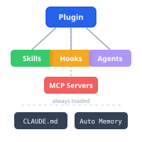
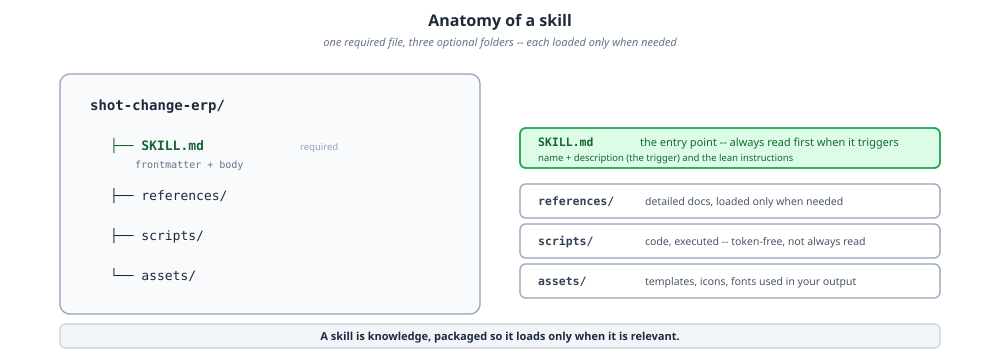
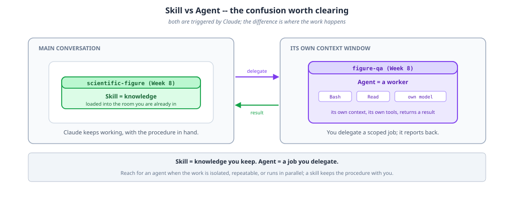
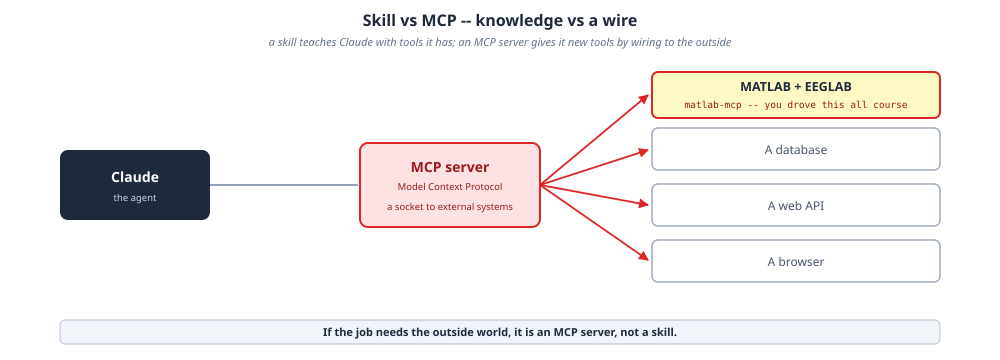

# Architecture

Every plugin in this marketplace is built from the same small set of building blocks: skills, agents, and (for the tools that reach outside the agent) MCP servers. This page explains what each one is for and when to reach for which.

## Plugin anatomy

A plugin is a bundle of **skills**, **hooks**, **agents**, and **MCP servers**, installed alongside the always-loaded project instructions (`CLAUDE.md`/`AGENTS.md`) and, in Claude Code, auto memory. This marketplace's plugins mostly ship skills, plus a handful of bundled agents for review/QA surfaces (see [`project:pr-review-toolkit`](plugins/project.md), [`grant:grant-review`](plugins/grant.md), [`manuscript:paper-review`](plugins/manuscript.md), [`figures:figure-qa`](plugins/figures.md), and the neuroinformatics BIDS validator).

## Anatomy of a skill

A skill is one required file plus three optional folders, each loaded only when needed:

- **`SKILL.md`**: the entry point, always read first when the skill triggers. Its frontmatter (`name` + `description`) is the trigger; the body is the lean, always-loaded instructions.
- **`references/`**: detailed docs, loaded only when the skill's body points at them.
- **`scripts/`**: code that gets executed, not read; token-free once written.
- **`assets/`**: templates, icons, and fonts used in the skill's output.

In short: a skill is knowledge, packaged so it loads only when it is relevant.

## Skill vs. agent

Both are triggered by the agent runtime, but they differ in where the work happens:

- A **skill** loads knowledge into the conversation you're already in; the model keeps working, with the procedure in hand.
- An **agent** is a worker with its own context window, its own tools, and (optionally) its own model. You delegate a scoped job to it; it returns a result.

Reach for an agent when the work is isolated, repeatable, or runs in parallel (fan-out reviews, QA passes, background validation). A skill keeps the procedure with you when the work benefits from staying in the main conversation.

## Skill vs. MCP

A skill teaches the agent using tools it already has. An **MCP (Model Context Protocol) server** gives it new tools by wiring to something outside the agent entirely: a database, a web API, a browser, or an external application like MATLAB/EEGLAB. If the job needs to reach the outside world, it's an MCP server's job, not a skill's.

## Cross-agent design

Every skill in this marketplace is written once and shared across Claude Code, Codex, and Copilot CLI, with thin per-runtime manifests pointing at the same `skills/` trees. See [Cross-Agent Compatibility](cross-agent-compatibility.md) for exactly how each runtime discovers and registers plugins, skills, commands, and agents.

Want to build your own plugin on top of these patterns? The [Agentic Research Course](https://courses.osc.earth/agentic-research/) week 10, "Building Your Own Plugins," walks through skills, hooks, agents, and MCP integration end to end.
