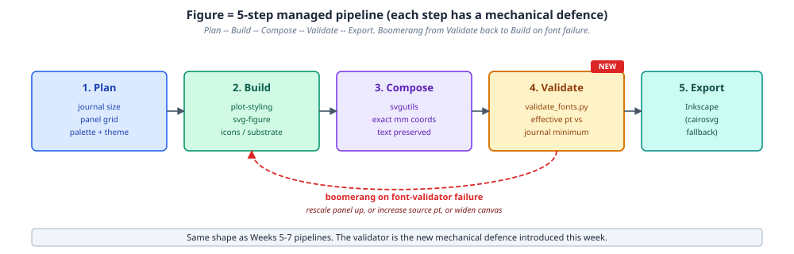
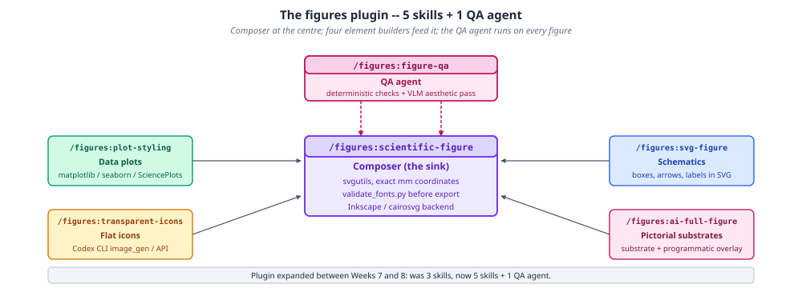
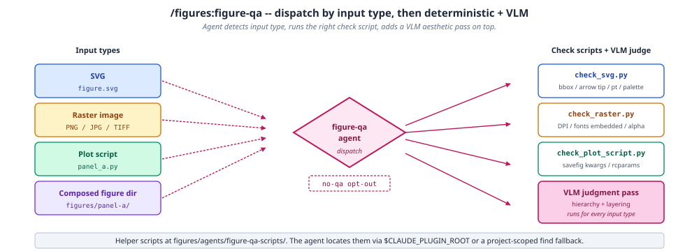

# Figures

The `figures` plugin composes publication-quality figures at exact journal dimensions (Nature, Science, PNAS, Cell, and others) and QAs them before they go anywhere near a submission.

## The figure pipeline

A figure moves through five steps, each with its own mechanical defense against the most common failure at that step, and a boomerang from validation straight back to building when a font fails:



1. **Plan** — journal, size, panel grid, palette and theme
2. **Build** — `plot-styling` for data plots, `svg-figure`/`svg-primitives` for schematics, icons, or an AI-generated substrate
3. **Compose** — `svgutils` places panels at exact mm coordinates, with text preserved as inspectable `<text>` elements
4. **Validate** — `validate_fonts.py` reports the effective point size against the journal minimum
5. **Export** — Inkscape when available on `$PATH`, `cairosvg` fallback otherwise

When the validator fails, the fix is mechanical: rescale the panel up, increase the source point size, or widen the canvas — not a redesign.

## The plugin map

The plugin is a composer at the center, four element-builder skills that feed it, and a QA agent that runs on every figure regardless of how it was built:



## Skills

- **scientific-figure** — the composer (the sink): `svgutils`-based, exact mm coordinates, `validate_fonts.py` before export, Inkscape/cairosvg backend
- **plot-styling** — data plots via matplotlib, seaborn, plotnine, plotly, or PyVista, with SciencePlots recipes for Nature/IEEE/Science/Cell/PNAS/APS
- **svg-figure** / **svg-primitives** — hand-authored or programmatic schematics: boxes, arrows, and labels in SVG, with `svg-primitives` preferred for new work (mm-precise, auto-fit text, tangent-correct arrows, in-process validation)
- **transparent-icons** — flat scientific icons via the Codex CLI `image_gen` tool or the OpenAI Images API, with Pillow-threshold or opt-in `rembg`+BiRefNet transparency
- **ai-full-figure** — an AI-generated pictorial substrate plus programmatic label/arrow/scale-bar overlay, so the model never hallucinates the labels themselves
- **figure-qa** — the QA agent described below, run against every figure regardless of how it was built

## How figure-qa decides what to check

`figure-qa` dispatches on input type, runs the matching deterministic check script, then always adds a VLM aesthetic pass on top:



- **SVG** → `check_svg.py` (bbox / arrow-tip-to-target / point size / palette)
- **Raster** (PNG/JPG/TIFF) → `check_raster.py` (DPI / embedded fonts / alpha channel)
- **Plot script** → `check_plot_script.py` (`savefig` kwargs / rcParams)
- **Composed-figure directory** → all of the above, per panel

Programmatic checks own anything with ground truth (font minima, palette compliance, geometry); the VLM judgment pass is reserved for "does this look balanced" — hierarchy, alignment, palette coherence, journal fit.

## Try it

```
"Create a Nature 2-column figure with 3 panels showing EEG spectrograms"
"QA this figure for Science submission requirements"
"Generate a transparent icon of a neuron for my poster"
```

## Learn more

The [Agentic Research Course](https://courses.osc.earth/agentic-research/) week 8, "Scientific Figures," covers this plugin hands-on.
