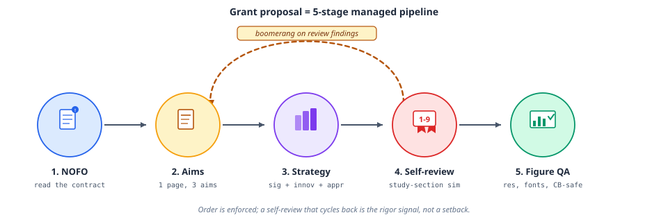
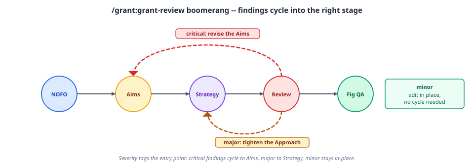
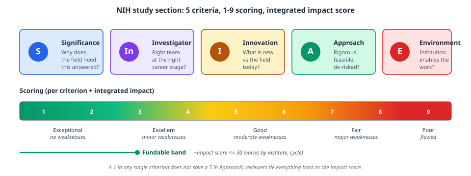

# Grant

The `grant` plugin drafts and reviews NIH and NSF grant proposals with mechanism-specific templates (R01, R21, K99, CAREER, SBIR/STTR, and more), plus a figure-QA skill scoped to grant-specific compliance checks.

## The proposal pipeline

Writing a proposal is a five-stage managed pipeline, with review findings boomeranging back to an earlier stage rather than being patched in place:



1. **NOFO**: read the funding opportunity as a contract
2. **Aims**: one page, three aims
3. **Strategy**: significance, innovation, and approach, scored 1-9
4. **Self-review**: a study-section simulation via `grant-review`
5. **Figure QA**: resolution, fonts, colorblind-safe palettes via `grant-figure-qa`

Order is enforced; a self-review that cycles back to an earlier stage is the rigor signal working as intended, not a setback.

Findings from the self-review stage are severity-tagged, and the severity determines where they cycle back to:



- **Critical**: revise the Aims
- **Major**: tighten the Approach
- **Minor**: edit in place, no cycle needed

## How NIH scores a proposal

`grant-review`'s NIH rubric mirrors how an actual study section scores a proposal: five criteria, each 1-9, rolled into one integrated impact score.



A 1 in any single criterion does not save a 5 in Approach; reviewers tie everything back to the integrated impact score, not the best individual criterion. (As of the 2025 Simplified Review Framework, RPG mechanisms score three factors, Importance, Rigor & Feasibility, and Expertise & Resources, rather than the five shown here; F fellowships and T training grants follow their own separately revised frameworks. SBIR/STTR mechanisms are outside that framework and keep the five scored criteria shown here, with commercial-potential questions inside each. See the `grant-review` skill for the current mechanism-specific rubric.)

## Small business applications

SBIR and STTR applications are a different genre from a research grant, and the plugin treats them as one.

- **Milestones, not hypotheses**: `examples/sbir-specific-aims-template.md` closes each aim with a quantitative acceptance threshold and a go/no-go condition, and contrasts itself line by line against the hypothesis-driven template.
- **The 12-page Commercialization Plan**: required for Phase II, Direct to Phase II, Phase IIB, and Fast-Track, forbidden in a standalone Phase I, and scored. `references/commercialization-plan-guide.md` walks its six prescribed sections.
- **Small business review criteria**: commercial potential is scored inside all five criteria, and additional criteria cover Phase I milestones, Phase I progress, and Fast-Track acceptability.
- **Funded samples**: `references/niaid-sample-applications.md` indexes the NIAID sample applications and summary statements with what to study in each, and `scripts/fetch-niaid-samples.sh` downloads them on demand. The samples are copyrighted and licensed for nonprofit educational use, so they are referenced rather than redistributed.

## Skills

- **grant-writing**: research strategy guidelines, writing style, budget justification, and resubmission response, with mechanism-specific templates, including a milestone-driven aims template and Commercialization Plan guide for small business applications
- **grant-review**: the NIH/NSF study-section simulation described above; a thin-dispatch skill with a Claude-bundled fresh-context agent, a Codex agent template, and a Copilot plugin-agent template; when no agent is configured, the skill runs the same reference procedure inline
- **grant-figure-qa**: checks figures for resolution, accessibility, and NIH/NSF compliance, following the same dispatch pattern as `grant-review`

## Try it

```
"Write the significance section for an R01 on motor cortex"
"Review my R21 proposal at proposal.pdf as an NIH study section"
"Draft milestone-driven specific aims for an SBIR Phase I"
"Write the commercialization plan for my Phase II application"
```

## Learn more

The [Agentic Research Course](https://courses.osc.earth/agentic-research/) week 6, "Grant Proposal Writing," walks through NIH/NSF proposals hands-on.
