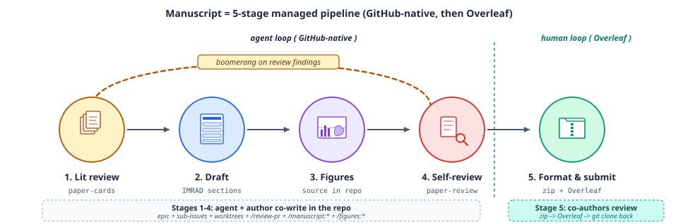
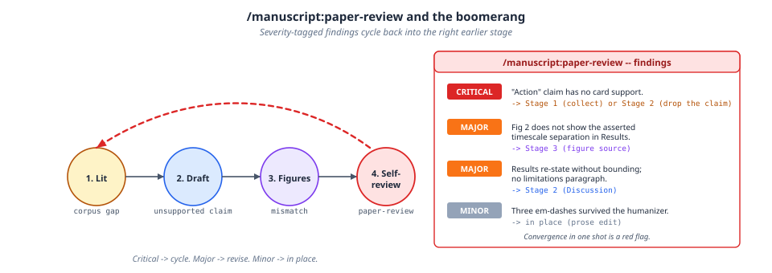
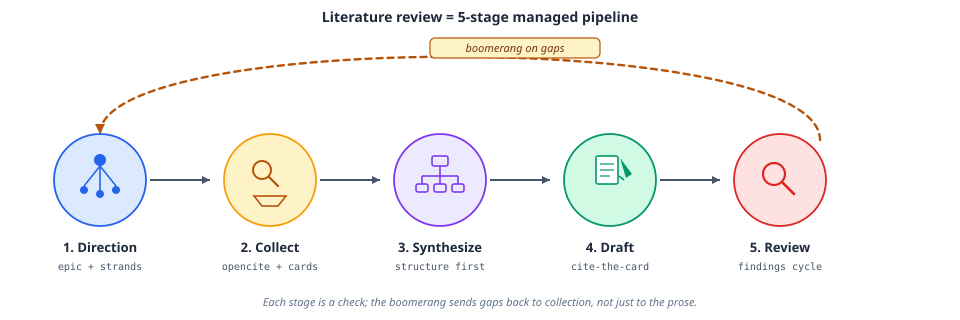
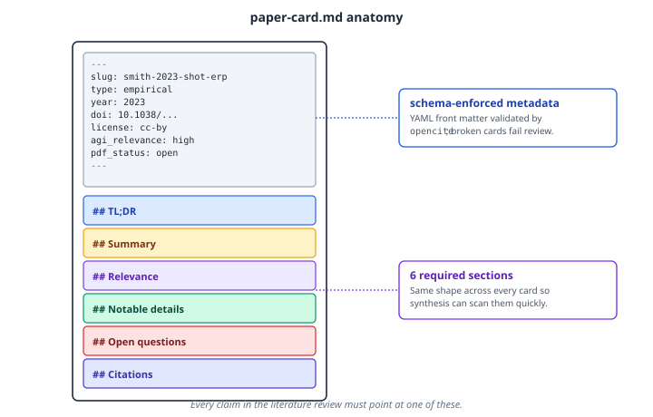

# Manuscript

The `manuscript` plugin covers the full manuscript lifecycle: literature review, writing (IMRAD structure, section templates), peer review (methodology, statistics, reproducibility), journal-specific formatting, and a final humanizer pass that strips AI-writing tells.

## The manuscript pipeline

Like the grant pipeline, a manuscript moves through five managed stages, but it crosses a loop boundary partway through: the first four stages are an agent + author co-writing loop inside the repo (GitHub-native: epics, sub-issues, worktrees, `pr-review-toolkit`, the `manuscript:*` and `figures:*` skills), and the last stage hands off to a human co-author review loop in Overleaf.



1. **Lit review**: paper-cards (see below)
2. **Draft**: IMRAD sections
3. **Figures**: sourced in-repo
4. **Self-review**: `paper-review`
5. **Format & submit**: zip export, then Overleaf; co-authors review the Overleaf copy and changes get cloned back to the repo

As with grants, `paper-review` findings are severity-tagged and cycle back to a specific earlier stage rather than being patched wherever they surface:



Convergence in one review pass is treated as a red flag, not a good sign: critical findings should cycle back to collection or drafting, major findings back to figures, and only minor prose issues (like a stray em dash the humanizer missed) get edited in place.

## Literature review, in two modes

`manuscript:lit-review` covers two workflows: a rigorous, citation-traceable multi-phase protocol, and an express single-pass synthesis for writing an Introduction or Background section. The multi-phase mode is itself a five-stage pipeline that can delegate its epic/sub-issue/worktree orchestration to `project:epic-dev`:



Every claim in a multi-phase review must trace back to a paper-card on disk: a schema-enforced markdown file with YAML front matter (slug, type, year, DOI, license, relevance, PDF status) and six required sections, validated by `opencite`:



The same shape across every card is what lets synthesis scan the corpus quickly instead of re-reading full papers.

## Skills

- **lit-review**: both literature-review modes described above
- **manuscript-writing**: IMRAD structure and section templates
- **paper-review**: the peer-review simulation described above; thin-dispatch with a Claude-bundled fresh-context agent, a Codex agent template, and a Copilot plugin-agent template
- **manuscript-formatting**: journal-specific formatting (IEEE, Nature, PNAS, Elsevier, LaTeX/BibTeX management) plus revision-response templates
- **humanizer**: a final natural-writing pass that removes AI-writing tells while preserving meaning and discipline conventions

## Try it

```
"Review this manuscript at paper.pdf as a peer reviewer"
"Format my paper for Nature Neuroscience"
"Start a multi-phase lit review on EEG-based BCIs with strands tools, data, science"
"Write a single-pass literature review on motor cortex oscillations"
```

## Learn more

The [Agentic Research Course](https://courses.osc.earth/agentic-research/) week 7, "Manuscript Preparation and Peer Review," and week 5, "Literature Search and Review," cover this plugin hands-on.
