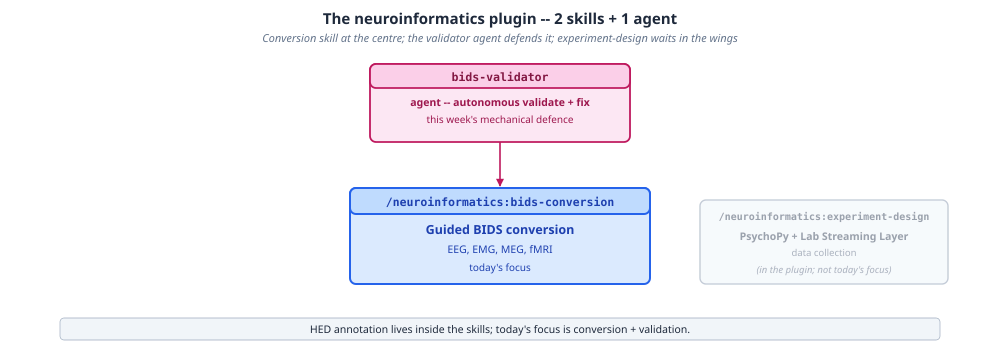
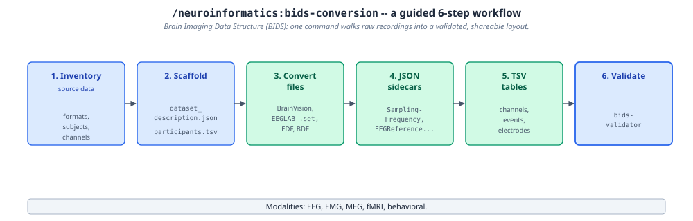
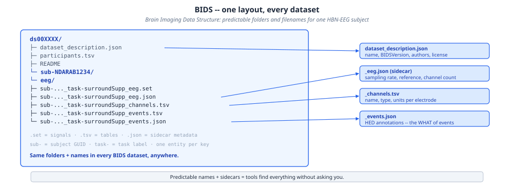
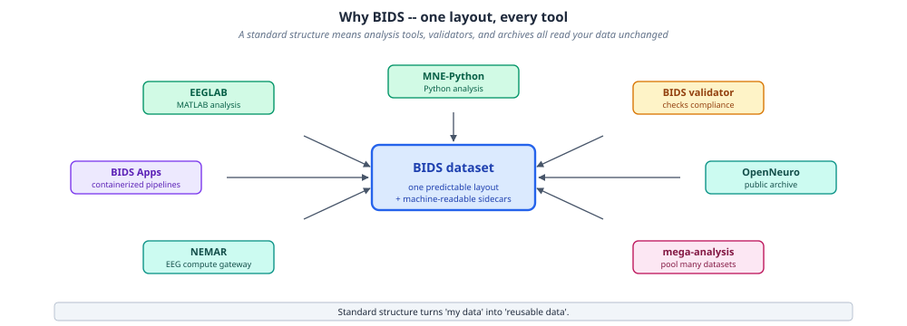
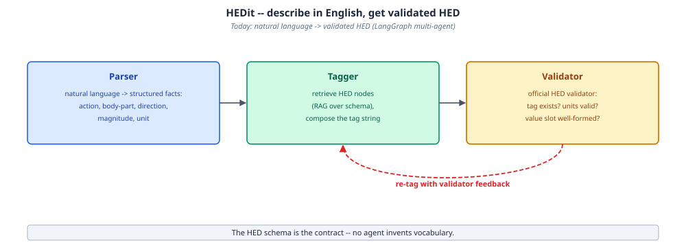

# Neuroinformatics

The `neuroinformatics` plugin covers neuroscience data standards (Brain Imaging Data Structure (BIDS), Hierarchical Event Descriptors (HED)), experiment design (PsychoPy, Lab Streaming Layer (LSL)), and dataset validation.

## Two skills, one defending agent

A conversion skill sits at the center; a validator agent defends its output; experiment design covers the data-collection side that happens before conversion:



- **bids-conversion** — guided conversion to BIDS for EEG, EMG, MEG, fMRI, and other modalities
- **bids-validator agent** — autonomous validate-and-fix: runs `bids-validator`, diagnoses errors, and applies corrections
- **experiment-design** — PsychoPy + LSL experiment scaffolding, feeding BIDS-compatible output back into conversion

## One command, six steps, to a validated dataset

Converting raw recordings into a shareable BIDS dataset is a fixed sequence:



1. **Inventory** — source data formats, subjects, channels
2. **Scaffold** — `dataset_description.json`, `participants.tsv`
3. **Convert files** — BrainVision, EEGLAB `.set`, EDF, BDF, and others
4. **JSON sidecars** — `SamplingFrequency`, `EEGReference`, and other required metadata
5. **TSV tables** — channels, events, electrodes
6. **Validate** — `bids-validator`

## Why the layout is fixed

BIDS's predictable folders and filenames are what let EEGLAB, MNE-Python, `bids-validator`, BIDS Apps, OpenNeuro, and NEMAR all read a dataset without dataset-specific glue code:





A standard structure turns "my data" into "reusable data" — the same folder and filename conventions apply to every BIDS dataset, anywhere, which is what makes cross-dataset tools and mega-analysis pooling possible in the first place.

## HED annotation

HED annotation — tagging events with a standardized, machine-readable vocabulary for the *what* of an event, not just its timing — lives inside the `bids-conversion` and `experiment-design` skills' reference material rather than as a separate skill. Conceptually, going from a plain-English event description to a schema-valid HED tag string is a parse → tag → validate pipeline:



The HED schema is the contract — nothing in that pipeline invents vocabulary outside it.

## Try it

```
"Convert ./raw-data to BIDS format, modality EEG, task rest"
"Validate the BIDS dataset at ./bids-dataset"
"Design a visual oddball ERP paradigm with 2 conditions"
```

## Learn more

The [Agentic Research Course](https://courses.osc.earth/agentic-research/) week 9, "Neuroinformatics," covers BIDS, HED, and experiment design hands-on.
