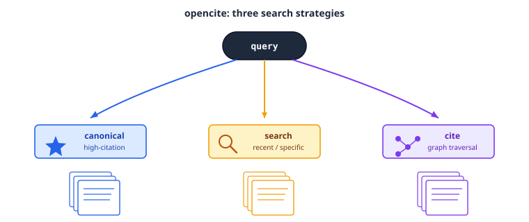
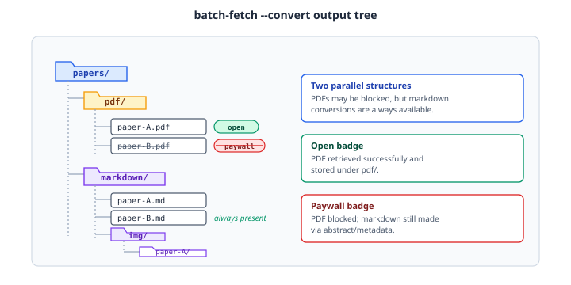

# Opencite

The `opencite` plugin searches academic literature, explores citation graphs, downloads PDFs, and exports BibTeX. It wraps the [`opencite`](https://github.com/neuromechanist/opencite) CLI, aggregating Semantic Scholar, OpenAlex, PubMed, arXiv, and bioRxiv into one interface.

## Three search strategies

`opencite` picks a search strategy based on what you're actually looking for:



- **Query** — canonical, high-citation search for foundational papers on a topic
- **Recent / specific** — targeted search for a known paper or a narrow, recent result
- **Cite graph** — traversal of citation links (what cites this, what this cites)

## Batch fetch, two parallel output trees

A batch fetch-and-convert run always produces two parallel structures — one for PDFs, one for markdown — because PDFs are sometimes paywalled but a markdown conversion from abstract/metadata is always available:



- **Open** badge — the PDF was retrieved successfully and stored under `pdf/`
- **Paywall** badge — the PDF was blocked; a markdown conversion was still made from the abstract/metadata

This is also the corpus format that `manuscript:lit-review`'s multi-phase mode builds paper-cards from.

## Skills

- **opencite** — literature search across the aggregated sources above, citation-graph exploration, PDF download, PDF-to-markdown conversion, and BibTeX export

## Try it

```
"Find the top 10 most cited papers on brain-computer interfaces"
"Look up DOI 10.1038/nature12373 and download the PDF"
"Convert this PDF to markdown"
```

## Learn more

The [Agentic Research Course](https://courses.osc.earth/agentic-research/) week 5, "Literature Search and Review," covers this plugin hands-on.

!!! note
    The `opencite` plugin here is a snapshot of the standalone [`neuromechanist/opencite`](https://github.com/neuromechanist/opencite) plugin. If you've already installed that standalone plugin, don't install it again from this marketplace — having both installed creates duplicate skills.
