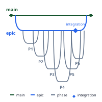
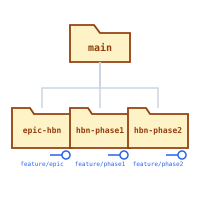
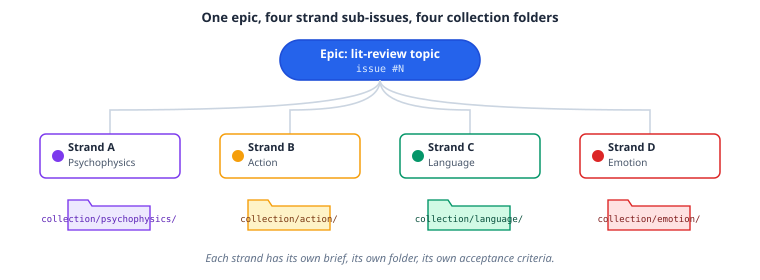

# Project

The `project` plugin is the marketplace's development-lifecycle toolkit: initialization, epic/sprint workflow, PR review, CI/CD scaffolding, and a set of core engineering-workflow skills (onboarding, planning, the day-to-day change loop, debugging, and multi-agent orchestration).

## Epics, phases, and worktrees

Complex, multi-phase features are epics: one epic issue, broken into phase sub-issues, each developed in its own git worktree so phases can run in parallel without stepping on each other's working tree.



Each phase gets its own worktree, checked out from the epic branch, so you can have several phases in progress on disk at once:



The same epic → sub-issue → worktree shape generalizes beyond code changes. `epic-dev` is the entry point other skills delegate to when they need git-tracked, parallelizable phase decomposition — for example, `manuscript:lit-review`'s multi-phase mode delegates strand orchestration (one strand per literature-review theme, each with its own sub-issue, worktree, and collection folder) to `project:epic-dev`:



`workflow-reference` documents the branch, state-file, worktree, and GitHub command conventions this pattern relies on.

## Skills

- **init-project** — scaffold new projects with `AGENTS.md`, a Claude Code `CLAUDE.md` import wrapper, `.rules/`, `.context/`, and config files
- **update-rules** — non-destructive sync of `AGENTS.md`, the `CLAUDE.md` adapter, and `.rules/` against the latest templates at user or project level
- **epic-dev** — the multi-phase feature workflow described above: git worktrees, GitHub issues, and phased PR delivery
- **workflow-reference** — branch, state-file, worktree, and GitHub command reference for epic/sprint workflows
- **pr-review-toolkit** — PR and recent-change review across code quality, tests, error handling, comments/docs, type design, and simplification
- **codebase-onboarding** — verified reconnaissance of an unfamiliar codebase or research field before planning or editing: a fixed bootstrap sequence, parallel read-only explorer fan-out, and a report contract separating verified facts from assumptions
- **implementation-planning** — plans a weaker model could execute: two registers by stakes, pre-registered decision gates, load-bearing-claim verification, and a mandatory open-judgment-calls list
- **engineering-loop** — the single-PR change workflow: mirror an existing pattern, pin tests first for refactors, per-commit gates against a measured baseline, review with all findings addressed or rejected with reasons
- **debugging** — reproduce-isolate-prove-fix-verify with anti-shortcut gates (never weaken tests or guardrails, no silent fallbacks)
- **agent-fanout** — orchestrating subagents and teammates within a session: spawning/messaging mechanics, a role taxonomy with worker-tier model routing, full-lifecycle briefing templates, and a hard cap of 40 agents per run computed before launch. This is a different pattern from the epic/worktree fan-out above — it's in-session delegation, not a git-tracked multi-phase workflow.
- **ci-scaffolding** — generate GitHub Actions workflows for Python (ruff + pytest) or TypeScript (biome + bun test)
- **docker-packaging** — multi-stage Dockerfiles with uv/bun, health checks, and security hardening
- **security-audit** — credential scanning, dependency audit, OWASP checklist, configuration hardening
- **document-processing** — PDF/image OCR, text extraction, markdown conversion

Includes autonomous agents: **dependency-auditor** (vulnerability scanning), **release-prep** (pre-release validation), and a Claude-bundled **pr-review-toolkit** reviewer.

## Try it

```
/init-project "Python EEG analysis package"
/update-rules project
/epic-dev "build a community dashboard"
/release-prep --minor
"Set up CI for this Python project with ruff and pytest"
"Process scanned-document.pdf and convert to markdown"
```

## Learn more

The [Agentic Research Course](https://courses.osc.earth/agentic-research/) week 3, "Project Management with AI," covers epics, sprints, and worktrees hands-on.
